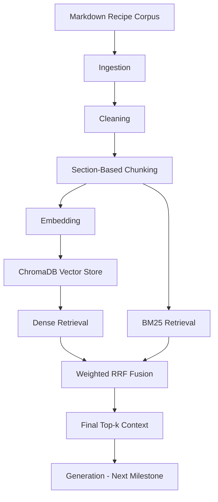

# Recipe RAG

A small, configurable Retrieval-Augmented Generation project built over a Markdown recipe corpus. The project is developed layer by layer so that ingestion, cleaning, chunking, embedding, storage, and retrieval can be inspected, tested, and debugged independently.

The current milestone completes the retrieval pipeline. Generation, end-to-end RAG evaluation, deployment, and CI/CD are the next milestones.

## Project goals

- Keep every RAG layer explicit and independently testable.
- Configure embedding models and retrieval strategies without changing application code.
- Evaluate changes against a fixed golden dataset instead of relying only on manual examples.
- Preserve intermediate artifacts for inspection and debugging.
- Produce failure reports that show exactly what each retriever returned in its top results.

## Current architecture



Implemented layers:

- **Ingestion:** loads 85 Markdown recipes into a common document schema.
- **Cleaning:** normalizes whitespace and line endings while preserving Markdown structure.
- **Chunking:** produces 272 parent-aware chunks split by recipe section.
- **Embedding:** supports BGE, E5, and MiniLM profiles.
- **Vector store:** persists one ChromaDB cosine index per embedding profile.
- **Retrieval:** supports dense, BM25, and weighted hybrid retrieval.
- **Evaluation:** benchmarks retrieval over 100 golden questions and exports error reports.

## Retrieval strategies

Three strategies are available:

- `dense`: embeds the query and searches the matching Chroma index.
- `bm25`: performs lexical retrieval directly over `chunks.jsonl`; it does not use embeddings or ChromaDB.
- `hybrid`: retrieves candidates from dense and BM25 branches and combines their ranks using weighted Reciprocal Rank Fusion.

The hybrid score is:

```text
dense_weight / (rrf_k + dense_rank)
+ bm25_weight / (rrf_k + bm25_rank)
```

## Dataset and evaluation

- Corpus: 85 English Markdown recipes in `data/raw/`.
- Golden dataset: `data/evaluation/golden_recipes_100_en.jsonl`.
- Questions: 100 total, including 88 answerable and 12 unanswerable records.
- Retrieval metrics are calculated over the 88 answerable questions.
- Main metrics: Hit@1, Hit@3, Hit@5, MRR@5, and Source Recall@5.

### Current baselines

| Strategy         | Embedding           |  Dense/BM25 weights |            Hit@1 |            Hit@3 |            Hit@5 |            MRR@5 |  Source Recall@5 |
| ---------------- | ------------------- | ------------------: | ---------------: | ---------------: | ---------------: | ---------------: | ---------------: |
| Dense            | BGE Small           |                  — |           0.5341 |           0.8068 |           0.8864 |           0.6716 |           0.8580 |
| Dense            | E5 Small            |                  — |           0.5114 |           0.8409 |           0.8523 |           0.6600 |           0.8068 |
| Hybrid           | BGE Small           |           1.0 / 1.0 |           0.5114 |           0.7955 |           0.8750 |           0.6538 |           0.8371 |
| **Hybrid** | **BGE Small** | **1.5 / 0.5** | **0.5682** | **0.8182** | **0.8864** | **0.6939** | **0.8390** |

The current configuration uses BGE Small with hybrid weights `1.5 / 0.5`. It improves first-result ranking and MRR over the dense BGE baseline while preserving Hit@5. Dense BGE still has the stronger Source Recall@5, so the selected weights are a baseline rather than a final optimum.

## Project structure

```text
configs/
  embedding.yaml             # Active embedding profile and model settings
  retrieval.yaml             # Strategy, candidate sizes, RRF, and weights
data/
  raw/                       # Source Markdown corpus
  evaluation/                # Versioned golden dataset
  processed/                 # Generated artifacts; ignored by Git
  vector_store/              # Generated Chroma indexes; ignored by Git
scripts/
  build_processed_data.py    # Raw Markdown → cleaned JSONL
  build_chunks.py            # Cleaned documents → section chunks
  build_embeddings.py        # Chunks → vectors for the active model
  build_vector_store.py      # Embedded chunks → persistent Chroma index
  inspect_retrieval.py       # Manually inspect one query
src/recipe_rag/
  ingestion/
  cleaning/
  chunking/
  embedding/
  vector_store/
  retrieval/
    dense_retriever.py
    bm25_retriever.py
    hybrid_retriever.py
  generation/                # Placeholder for the next milestone
  evaluation/                # Placeholder for end-to-end RAG evaluation
tests/
  retrieval/
    test_retrieval_strategies.py  # Fast correctness tests for all strategies
    test_retriever.py              # Golden-dataset quality benchmark
```

## Setup on Windows PowerShell

Requirements: Python 3.12 and Git.

```powershell
python -m venv .venv
.\.venv\Scripts\Activate.ps1
python -m pip install --upgrade pip setuptools
python -m pip install -e ".[dev]"
```

The editable install makes changes under `src/` immediately importable without reinstalling the package after every edit.

## Build the retrieval artifacts

Run the build steps in order after changing the corpus, cleaning rules, or chunking logic:

```powershell
python .\scripts\build_processed_data.py
python .\scripts\build_chunks.py
python .\scripts\build_embeddings.py
python .\scripts\build_vector_store.py
```

When only the embedding model changes, run the final two build commands. When only retrieval strategy, candidate sizes, RRF parameters, or weights change, no rebuild is required.

Generated artifacts are stored separately by embedding profile:

```text
data/processed/embeddings/<profile>.jsonl
data/vector_store/<profile>/
```

## Configuration

Select the embedding profile in `configs/embedding.yaml`:

```yaml
embedding:
  active_model: bge_small  # bge_small | e5_small | minilm
```

Select and tune retrieval in `configs/retrieval.yaml`:

```yaml
retrieval:
  strategy: hybrid         # dense | bm25 | hybrid
  final_top_k: 5
  dense_top_k: 20
  bm25_top_k: 20
  rrf_k: 60
  weights:
    dense: 1.5
    bm25: 0.5
```

## Run and test

Run all automated tests:

```powershell
python -m pytest
```

Quickly verify the rules for dense, BM25, and hybrid retrieval independently of the active config:

```powershell
python -m pytest -s .\tests\retrieval\test_retrieval_strategies.py
```

Benchmark the strategy currently selected in `configs/retrieval.yaml`:

```powershell
python -m pytest -s .\tests\retrieval\test_retriever.py
```

Inspect one question manually:

```powershell
python .\scripts\inspect_retrieval.py
```

The benchmark writes a per-strategy CSV report under:

```text
data/processed/evaluation/retrieval_errors_<strategy>_<profile>.csv
```

Each failed top-one question retains all five retrieved candidates, including rank, source, section, score, content, dense rank, BM25 rank, and relevance label. This makes it possible to filter and compare failures in Excel without manually replaying every question.

## Testing philosophy

- Layer tests verify correctness and data invariants.
- Strategy tests verify retrieval rules even when another strategy is active in config.
- Golden-dataset tests measure quality and detect regressions.
- CSV reports support case-level debugging.
- `inspect_retrieval.py` is reserved for quick experiments and deeper inspection of individual failures.

## Roadmap

1. Review ambiguous golden records and finalize the retrieval benchmark.
2. Benchmark MiniLM and additional hybrid weights if needed.
3. Implement configurable generation with citations and refusal behavior.
4. Evaluate answer correctness, faithfulness, context usage, and unanswerable questions.
5. Add structured logging and an end-to-end pipeline entry point.
6. Build a small interactive deployment demo.
7. Add GitHub Actions for automated tests and deployment checks.

Detailed implementation history is recorded in `docs/flow.md`.
