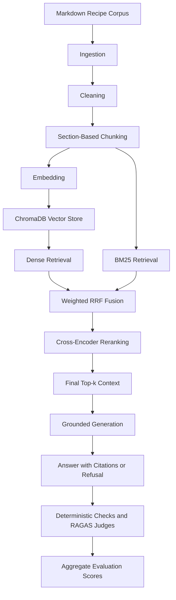

# Recipe RAG

A small, configurable Retrieval-Augmented Generation project built over a Markdown recipe corpus. The project is developed layer by layer so that ingestion, cleaning, chunking, embedding, storage, retrieval, and generation can be inspected, tested, and debugged independently.

The current milestone completes grounded generation and end-to-end answer evaluation. Deployment and CI/CD are the next milestones.

## Project goals

- Keep every RAG layer explicit and independently testable.
- Configure embedding models and retrieval strategies without changing application code.
- Evaluate changes against a fixed golden dataset instead of relying only on manual examples.
- Preserve intermediate artifacts for inspection and debugging.
- Produce failure reports that show exactly what each retriever returned in its top results.

## Current architecture



Implemented layers:

- **Ingestion:** loads 85 Markdown recipes into a common document schema.
- **Cleaning:** normalizes whitespace and line endings while preserving Markdown structure.
- **Chunking:** produces 272 parent-aware chunks split by recipe section.
- **Embedding:** supports BGE, E5, and MiniLM profiles.
- **Vector store:** persists one ChromaDB cosine index per embedding profile.
- **Retrieval:** supports dense, BM25, weighted hybrid retrieval, and optional cross-encoder reranking.
- **Generation:** calls a configurable OpenAI-compatible model with retrieved context, citations, refusal behavior, and basic guardrails.
- **Evaluation:** combines deterministic checks with RAGAS LLM-as-judge metrics and prints aggregate scores.

## Retrieval strategies

Three strategies are available:

- `dense`: embeds the query and searches the matching Chroma index.
- `bm25`: performs lexical retrieval directly over `chunks.jsonl`; it does not use embeddings or ChromaDB.
- `hybrid`: retrieves candidates from dense and BM25 branches and combines their ranks using weighted Reciprocal Rank Fusion.

An optional cross-encoder then scores each `query + candidate chunk` pair jointly and reranks the first-stage candidates before returning the final top-k. The current reranker is `cross-encoder/ms-marco-MiniLM-L6-v2`.

The hybrid score is:

```text
dense_weight / (rrf_k + dense_rank)
+ bm25_weight / (rrf_k + bm25_rank)
```

## Dataset and evaluation

- Corpus: 85 English Markdown recipes in `data/raw/`.
- Golden dataset: `data/evaluation/golden_recipes_100_en.jsonl`.
- Questions: 100 total, including 88 answerable and 12 unanswerable records.
- Retrieval metrics are calculated over the 88 answerable questions.
- Main metrics: Hit@1, Hit@3, Hit@5, MRR@5, and Source Recall@5.

### Current baselines

| Strategy         | Embedding           |  Dense/BM25 weights |            Hit@1 |            Hit@3 |            Hit@5 |            MRR@5 |  Source Recall@5 |
| ---------------- | ------------------- | ------------------: | ---------------: | ---------------: | ---------------: | ---------------: | ---------------: |
| Dense            | BGE Small           |                  — |           0.5341 |           0.8068 |           0.8864 |           0.6716 |           0.8580 |
| Dense            | E5 Small            |                  — |           0.5114 |           0.8409 |           0.8523 |           0.6600 |           0.8068 |
| Hybrid           | BGE Small           |           1.0 / 1.0 |           0.5114 |           0.7955 |           0.8750 |           0.6538 |           0.8371 |
| Hybrid | BGE Small | 1.5 / 0.5 | 0.5682 | 0.8182 | 0.8864 | 0.6939 | 0.8390 |
| **Hybrid + reranker** | **BGE Small** | **1.5 / 0.5** | **0.7045** | **0.8977** | **0.9205** | **0.7973** | **0.9015** |

The current configuration uses BGE Small, hybrid weights `1.5 / 0.5`, and a cross-encoder over 20 candidates. Reranking produces the strongest result across every measured retrieval metric, reducing top-one error questions from 38 to 26. The trade-off is latency: the 100-question CPU benchmark increases from roughly 22 seconds to 159 seconds.

### End-to-end RAG baseline

The complete 100-question generation run evaluates all deterministic rules and uses RAGAS judges for the 88 answerable questions.

| Metric | Score |
| --- | ---: |
| Refusal accuracy | 0.9700 |
| Citation validity | 1.0000 |
| Citation gold precision | 0.8113 |
| Must-include recall | 0.7320 |
| Faithfulness | 0.9437 |
| Answer relevancy | 0.8906 |
| Factual correctness | 0.5810 |

The full run completed without judge errors in roughly 43 minutes. RAGAS metrics may make several internal LLM calls per case; the provider dashboard reached about 707 requests during the session. Use `--limit 10` while tuning and reserve all 100 cases for milestone baselines.

## Project structure

```text
configs/
  embedding.yaml             # Active embedding profile and model settings
  retrieval.yaml             # Strategy, candidate sizes, RRF, and weights
  generation.yaml            # Prompt limits, output size, and refusal behavior
  evaluation.yaml            # Sample limit and judge settings
data/
  raw/                       # Source Markdown corpus
  evaluation/                # Versioned golden dataset
  processed/                 # Generated artifacts; ignored by Git
  vector_store/              # Generated Chroma indexes; ignored by Git
scripts/
  build_processed_data.py    # Raw Markdown → cleaned JSONL
  build_chunks.py            # Cleaned documents → section chunks
  build_embeddings.py        # Chunks → vectors for the active model
  build_vector_store.py      # Embedded chunks → persistent Chroma index
  inspect_retrieval.py       # Manually inspect one query
  inspect_generation.py      # Run retrieval and generation for one question
  inspect_evaluation.py      # Evaluate generated answers and print scores
src/recipe_rag/
  ingestion/
  cleaning/
  chunking/
  embedding/
  vector_store/
  retrieval/
    dense_retriever.py
    bm25_retriever.py
    hybrid_retriever.py
    reranker.py
  generation/                # Grounded answer generation and guardrails
  evaluation/                # Deterministic checks and optional RAGAS judges
tests/
  evaluation/
    test_evaluator.py             # Evaluation rules without real API calls
  generation/
    test_generator.py              # Fake-client generation and guardrail tests
  retrieval/
    test_retrieval_strategies.py  # Fast correctness tests for all strategies
    test_retriever.py              # Golden-dataset quality benchmark
```

## Setup on Windows PowerShell

Requirements: Python 3.12 and Git.

```powershell
python -m venv .venv
.\.venv\Scripts\Activate.ps1
python -m pip install --upgrade pip setuptools
python -m pip install -e ".[dev]"
```

Install the optional RAGAS evaluation dependencies when running answer-quality judges:

```powershell
python -m pip install -e ".[dev,evaluation]"
```

The editable install makes changes under `src/` immediately importable without reinstalling the package after every edit.

## Build the retrieval artifacts

Run the build steps in order after changing the corpus, cleaning rules, or chunking logic:

```powershell
python .\scripts\build_processed_data.py
python .\scripts\build_chunks.py
python .\scripts\build_embeddings.py
python .\scripts\build_vector_store.py
```

When only the embedding model changes, run the final two build commands. When only retrieval strategy, candidate sizes, RRF parameters, or weights change, no rebuild is required.

Generated artifacts are stored separately by embedding profile:

```text
data/processed/embeddings/<profile>.jsonl
data/vector_store/<profile>/
```

## Configuration

Select the embedding profile in `configs/embedding.yaml`:

```yaml
embedding:
  active_model: bge_small  # bge_small | e5_small | minilm
```

Select and tune retrieval in `configs/retrieval.yaml`:

```yaml
retrieval:
  strategy: hybrid         # dense | bm25 | hybrid
  final_top_k: 5
  dense_top_k: 20
  bm25_top_k: 20
  rrf_k: 60
  weights:
    dense: 1.5
    bm25: 0.5
  reranking:
    enabled: true
    model_name: cross-encoder/ms-marco-MiniLM-L6-v2
    candidate_top_k: 20
    batch_size: 32
```

Set the API endpoint locally in `.env` using `.env.example` as the template:

```env
LLM_API_KEY=your_api_key
LLM_BASE_URL=https://your-provider.example/v1
LLM_MODEL=your-model-name
```

Generation limits and refusal behavior are configured in `configs/generation.yaml`. Secrets are never stored in YAML or committed to Git.

## Run and test

Run all automated tests:

```powershell
python -m pytest
```

Quickly verify the rules for dense, BM25, and hybrid retrieval independently of the active config:

```powershell
python -m pytest -s .\tests\retrieval\test_retrieval_strategies.py
```

Benchmark the strategy currently selected in `configs/retrieval.yaml`:

```powershell
python -m pytest -s .\tests\retrieval\test_retriever.py
```

Inspect one question manually:

```powershell
python .\scripts\inspect_retrieval.py
```

Run retrieval and generate a grounded answer with citations:

```powershell
python .\scripts\inspect_generation.py
```

Test generation and guardrails without calling the real API:

```powershell
python -m pytest -s .\tests\generation\test_generator.py
```

Run 10 end-to-end cases without RAGAS judge calls (generation still calls the configured LLM):

```powershell
python .\scripts\inspect_evaluation.py --limit 10 --deterministic-only
```

Run the same cases with RAGAS faithfulness, answer relevancy, and factual correctness:

```powershell
python .\scripts\inspect_evaluation.py --limit 10
```

Start with `--limit 1` when validating a new provider because RAGAS makes multiple judge calls per answerable case. RAGAS prints aggregate scores directly to the terminal and does not create a CSV.

The benchmark writes a per-strategy CSV report under:

```text
data/processed/evaluation/retrieval_errors_<strategy>_<profile>.csv
```

Each failed top-one question occupies one row with seven columns: question ID, error type, question, expected answer, gold source/section, first relevant rank, and the five retrieved chunks. Internal vector and ranking details are omitted.

## Testing philosophy

- Layer tests verify correctness and data invariants.
- Strategy tests verify retrieval rules even when another strategy is active in config.
- Golden-dataset tests measure quality and detect regressions.
- The compact retrieval CSV supports case-level debugging without dumping internal scores.
- `inspect_retrieval.py` is reserved for quick experiments and deeper inspection of individual failures.
- Generation unit tests use a fake API client; only the manual generation script calls the configured endpoint.
- Evaluation unit tests never call the endpoint; RAGAS runs only from `inspect_evaluation.py`.

## Roadmap

1. Review ambiguous golden records and finalize the retrieval benchmark.
2. Measure reranker latency and tune candidate count for the deployment environment.
3. Review low evaluation scores and shorten answers that add unsupported or unnecessary detail.
4. Add structured logging and an end-to-end pipeline entry point.
5. Build a small interactive deployment demo.
6. Add GitHub Actions for automated tests and deployment checks.

Detailed implementation history is recorded in `docs/flow.md`.
